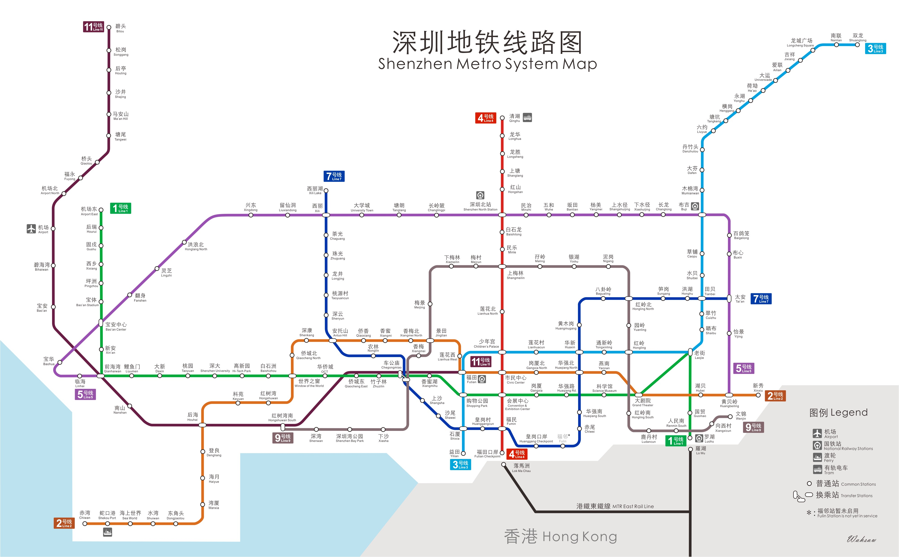

# 深圳地铁大数据客流分析系统

项目参考 [SZT-bigdata 深圳地铁大数据客流分析系统 🚇🚇🚇](https://github.com/geekyouth/SZT-bigdata) 

本项目借鉴了 **SZT-bigdata 深圳地铁大数据客流分析系统** ，对数据处理部分进行了部分借鉴，并在原作者的框架下进行了大量改动，原作者使用数据仓库的模式对数据进行查询和可视化取得了非常不俗的成果，本人由于时间原因和数据集规模不算特别大(百万级)没有走数据仓库的路线，使用 Flink 完成数据清洗和聚合后，再使用 Elasticsearch + Kibana 的的技术路线，完成了客流信息，地铁收入、乘客车费、乘车区间和乘车时间的查询和可视化。在此基础上，还使用 Flink 实现了计算各线路、站点和乘车区间的客流信息等实时计算功能。

再次对原作者的非凡的技术成果表示感谢，本人深受启发。原作者优秀的数仓建模和查询分析也已经列入本人后续的学习计划。

## 1 数据集介绍

### 1.1 数据来源

**深圳市政府数据开放平台**：https://opendata.sz.gov.cn/data/dataSet/toDataDetails/29200_00403601


### 1.2 数据集概况

1. 数据集共用 **1337000 条信息**，包括 **447708 条巴士的乘车**信息和 **781472 条地铁的出入站信息**。巴士数据和地铁数据存在明显的不同：
    - 乘坐巴士只需要上车的时候刷卡，因此一条记录就是一次乘车记录
    - 而地铁在进出站时均需要刷卡，因此需要同时拥有一张交通卡的**进出站记录才能构成一条完整的乘车记录**
2. 由于巴士的乘车记录比较简单，所有本项目中主要针对地铁的乘车记录进行计算和分析
3. 地铁部分数据集的日期是北京时间 **2018-09-01 05:00 ~ 2018-09-01-11:35**


### 1.3 数据字段介绍

|     字段     |  类型   |         示例          |     含义     |                说明                 |
| :----------: | :-----: | :-------------------: | :----------: | :---------------------------------: |
|   card_no    | String  |       FHDEFHEID       |     卡号     |                                     |
|  deal_date   | String  | "2018-09-01 08:58:51" | 交易日期时间 |                                     |
|  deal_type   | String  |       地铁出站        |   交易类型   |     {地铁入站、地铁出站、巴士}      |
|  deal_money  | Integer |          570          |   交易金额   | 优惠后金额，原始值除以100才是真实值 |
|  deal_value  | Integer |          600          |    交易值    | 优惠前金额，原始值除以100才是真实值 |
|    equ_no    | String  |       261029105       |   设备编码   |            刷卡设备编号             |
| company_name | String  |      地铁三号线       |   公司名称   |              乘坐线路               |
|   station    | String  |         吉祥          |   线路站点   |   地铁出入站站点或巴士的上车站点    |
|    car_no    | String  |        AGM-105        |    车牌号    |                                     |
|  conn_mark   | Integer |           0           |   联程标记   |             1 表示连乘              |
|  close_date  | String  | "2018-09-01 00:00:00" |   结算日期   |                                     |


### 1.4 地铁数据整体概况

本项目只针对地铁的乘车记录进行分析，下面对数据集的整体概况做介绍，如图 1 所示，当日(**2018-09-01 05:00 ~ 2018-09-01-11:35**)共计有 **8 条线路**的 **170 个站点**完成了 **781472 人次的出入站**，其中**入站 415741 人次**、**出站 365731 人次**，实际**营业收入 1426697.15 元**。因为不是一个完整的运营日所以出入站乘客人次并不相等。


<center>图 1.1 数据集概况</center>

> 部分闸机在不同的时间段可能充当不同的角色，所以进站闸机和出站闸机之和大于闸机总数量，因此在后面计算的时候会按照闸机实际充当的角色进行计算，但是计算不同站点闸机总数时候会扣除重复部分，以便于数据能够吻合。


### 1.5 平均指标 

|       指标       |               客流量                |                    备注                    |
| :--------------: | :---------------------------------: | :----------------------------------------: |
|   站点平均客流   |  **781472 / 170 ≈ 4597**​人次 / 站   | 以人次计算，同一名乘客进站、出站各计算一次 |
| 闸机平均入站人次 | **415741 / 1660 ≈ 250** 人次 / 闸机 |                                            |
| 闸机平均入站人次 | **365731 / 2256 ≈ 162**​ 人次 / 闸机 |                                            |
|    平均消费额    |  **1426697.15 / 365731 ≈ 3.90** 元  |      只有出站时才知道其乘车的具体消费      |
### 1.6  深圳地铁2018年9月开通运营的线路

2018年9月深圳地铁共计有8条线路投入运行，分别是1号线(罗宝线)、2号线、3号线(龙岗线)、4号线(龙华线)、5号线(环中线)、7号线(西丽线)、9号线(梅林线)、11号线(机场线)，其具体线路图入下所示[^1]。



<center>图 1.2 深圳地铁线路图(2018年9月)</center>

[^1]: https://www.loholiday.com/2018/03/12/%E6%B7%B1%E5%9C%B3%E5%9C%B0%E9%90%B5%E8%B7%AF%E7%B7%9A%E5%9C%962018%E5%B9%B4%E6%9C%80%E6%96%B0%E7%89%88%E6%9C%AC-%E5%87%BA%E7%99%BC%E5%89%8D%E4%B8%80%E5%AE%9A%E8%A6%81save%E4%BD%8E%EF%BC%81/

## 2 客流量相关统计

有关使用 Elasticsearch + Kibana实现数据可视化的具体细节，请参考本人另一个项目的 [**Kibana数据可视化步骤**](https://github.com/kailanyue/BitcoinPrice#4-kibana%E6%95%B0%E6%8D%AE%E5%8F%AF%E8%A7%86%E5%8C%96%E6%AD%A5%E9%AA%A4) 部分

### 2.1 线路客流量排行

如图 2.1 所示是线路的客流排行榜，其中蓝色是入站客流，绿色是出站客流，根据图中信息可得到：

- 总客流排名：5 号线、3 号线、1 号线、4 号线、2 号线、7 号线、11 号线、9 号线

- 入站客流排名：5 号线、3 号线、1 号线、4 号线、7 号线、11 号线、9 号线、2 号线

- 出站客流排名：1 号线、5 号线、3 号线、2 号线、4 号线、7 号线、11 号线、9 号线


<center>图 2.1 线路客流排行榜</center>

### 2.2 站点客流量排行

**总客流量的排行**

从图 2.2 站点总客流排行可以看出，五和、布吉站（深圳东火车站）、罗湖站（深圳火车站）、深圳北（深圳北高铁站）和民治分列前五，其中五和、布吉和民治入站客流明显多于出站客流，而罗湖站和深圳北则完全相反，这些车站基本都是不同线路的换乘车站。


<center>图 2.2 站点客流排行榜</center>

**入站客流排行**

对于入站客流，五和、布吉、丹竹头、民治和龙华分列前五


<center>图 2.3 站点入站客流排行榜</center>

**出站客流排行**

对于出站客流，深圳北、罗湖站、福田口岸、会展中心和老街分列前五


<center>图 2.4 站点出站客流排行榜</center>

### 2.3 入站闸机客流量排行

从图 2.5 中可以看出从编号 268030125、263018102 和 263024110 的设备入站客流最多


<center>图 2.5 入站闸机客流排行榜</center>

### 2.4 出站闸机客流量排行

出图2.6 中可以看出从 268022121、263025115和261021118闸机出站的客流最多


<center>图 2.6 出站闸机客流排行榜</center>

### 2.5 整体客流随时间变化趋势

从图 2.7 中可以看出，出入站客流随时间变化都出现了明显的高峰，但是具体来说又存在不同：

- 入站客流的高峰在 08:30 附近，早于出站客流高峰的 08:45 附近
- 在 08:37 之前入站的客流都是多于出站客流
- 出站客流在 08:35-08:55 出现了大幅增加，这也与大部分公司固定的 9 点上班相吻合。
- 整体来说入站客流的波动性没有出站客流那么剧烈，因为入站客流相对于地铁到站瞬间大量出站乘客来说相对更平稳没有那么明显的波峰出现。


<center>图 2.7 出入站客流随时间变化趋势</center>

### 2.6 不同线路客流随时间变化

由于图表篇幅的限制只显示客流量前四的线路。从图 2.8 中可以看出 地铁 5 号线、地铁 3 号线、地铁 1 号线在不同时间段客流量的变化较大，尤其是是 5 号线早高峰十分明显，由此推测人们的工作地点多集中在 5 号线附近，从客流量也可以佐证这个观点。


<center>图 2.8 不同线路客流随时间变化趋势</center>

### 2.7 不同线路的客流组成

以客流量最多的五号线为例，从图 2.9 可以看出五和、深圳北、民治三个站点的客流分别占全线客流的 $9.53\%$、$7.96\%$、$7.24\%$，同时这三个站的客流量也排名所以站点客流的第一、第四和第五位，右侧图例从上到下客流量依次减少。


<center>图 2.9 不同站点客流在线路客流中的占比</center>

## 3 收入消费指标统计

### 3.1 线路收入排行

从图 3.1 可以看出，虽然 1 号线的客流量只能排在 5 号线和 3 号线之后屈居第三，但是其线路的收入却排名第一。而客流量第四的 4 号线其收入只能排在第六位。


<center>图 3.1 不同线路收入排行</center>

### 3.2 站点收入排行

从图 3.2 可以看出，深圳北、罗湖和南山站收入排名前三，客流量第一的五和站排名第 9，而客流第 2 的布吉站和客流第 5 民治站收入排名并不在前 10 中，所以由此看出站点的收入同站点的客流并不是完全正相关，这也不难理解因为收入由客流量和消费金额共同决定。


<center>图 3.2 不同站点收入排行</center>


### 3.3 车辆收入排行


<center>图 3.3 不同车辆收入排行</center>

### 3.4 乘客消费排行

从图 3.4 可以看到9月1日上午，消费最多的乘客是交通卡号位 **FHIGEIEDB** 的乘客消费达到 48 元是平均消费 3.9 元($1426697.15/365731 \approx 3.9$) 的12倍多，且没有使用优惠，同时**消费排名前10的乘客都没有使用优惠卡**。


> 注意，由于数据采集日(2019-09-01)深圳通卡未实名，因此不涉及个人隐私式问题。

<center>图 3.4 不同交通卡消费排行</center>

### 3.5 各个站点对线路收入的贡献

以收入最多的地铁 1 号线为例，罗湖站、会展中心站和桃园站对全线的收入贡献分列前三，而前海湾则是全线副班长贡献最少。右侧图例从上到下对线路收入贡献依次减少。


<center>图 3.5 不同站点对线路收入的贡献</center>

### 3.6 不同消费金额次数占比

从图 3.6 中可以看出、实际消费金额为 2.85、1.9、4.75、3.8和5.7排名总消费次数的前五。

值得注意的是消费金额为0在总消费次数中的占比为 $2.13\%$，这个一方面是深圳地铁确实对部分人群免费乘坐，另外一部分是有内部员工卡产生的，这个可以参考 4.1 节中的数据示例。


<center>图 3.6 不同消费额在总消费次数中的占比</center>

### 3.7 不同消费金额在总额中的贡献

从图 3.7 中可以看出实际消费金额为 4.75、3.8、5.7、2.85和6.65对总收入的贡献排名前五，在消费次数中排名第一的 2.85 由于金额较低只能排名第四，消费次数中排名第二的1.9 更是只能排名第六。


<center>图 3.7 不同消费额在总收入中贡献比</center>


## 4 完整乘车记录中客流统计

### 4.1 数据过滤

数据中存在大量的数据不能构成完整的情况，如

- 对于一张卡只有入站或车站单条记录的显然不能构成一条完整的行程记录
- 对于入站点和出现点相同的情况显然是不合理的数据，同样不能构成一条合理行程记录
- 对于入站时间在 06:00 之前的记录同样不计算在内，因为深圳地铁的所有线路平均首班车时间在06:20左右，所以猜测可站点对外开放时间不会早于6:00。
- 对于按照时间排序之后同一张卡出现，连续两次均为入站或出站的视为不合法数据

入站时间早于06:00和入站点出站点相同的数据

```
# 深圳地铁的运营时间都是 6 点以后，所以之前的数据记录，均有内部工作人员活所产生，视为无效数据
# 如卡号为 HHJJAFGAH 的用户在同一条线路的同一站点产生的这 6 条数据，从实际消费金额为 0.0 也可以佐证此推论
1535752434000,HHJJAFGAH,0.0,0.0,地铁入站,地铁二号线,0,大剧院,AGM-109,260036109  2018/9/1 5:53:54
1535752629000,HHJJAFGAH,2.0,0.0,地铁出站,地铁二号线,0,大剧院,AGM-117,260036117  2018/9/1 5:57:9
1535754065000,HHJJAFGAH,0.0,0.0,地铁入站,地铁二号线,0,大剧院,AGM-109,260036109  2018/9/1 6:21:5
1535754386000,HHJJAFGAH,2.0,0.0,地铁出站,地铁二号线,0,大剧院,AGM-117,260036117  2018/9/1 6:26:26
1535758541000,HHJJAFGAH,0.0,0.0,地铁入站,地铁二号线,0,大剧院,AGM-113,260036113
1535758687000,HHJJAFGAH,2.0,0.0,地铁出站,地铁二号线,0,大剧院,AGM-105,260036105

# 随然该持卡人极可能是内部用户，但是下面这条数据将被作为有效数据，因为乘车事件是真实发生的从大剧院 -> 晒布
1535766418000,HHJJAFGAH,0.0,0.0,地铁入站,地铁二号线,0,大剧院,AGM-117,260036117  2018/9/1 9:46:58
1535767398000,HHJJAFGAH,2.0,0.0,地铁出站,地铁三号线,0,晒布,AGM-105,261013105    2018/9/1 10:3:18
```

连续两次均为入站的数据

```
1535755820000,CBCGDHCBB,0.0,0.0,地铁入站,地铁五号线,0,太安,AGT-118,263035118
1535759424000,CBCGDHCBB,0.0,0.0,地铁入站,地铁四号线,0,清湖,AGM-105,262011105
1535759862000,CBCGDHCBB,2.0,1.9,地铁出站,地铁四号线,0,清湖,AGM-108,262011108

1535756340000,HHACJJFHE,0.0,0.0,地铁入站,地铁四号线,0,莲花北,AGM-109,262020109
1535756926000,HHACJJFHE,0.0,0.0,地铁入站,地铁四号线,0,上梅林,AGM-110,262019110
1535757664000,HHACJJFHE,2.0,0.0,地铁出站,地铁四号线,0,上梅林,AGM-104,262019104
1535758092000,HHACJJFHE,0.0,0.0,地铁入站,地铁四号线,0,上梅林,AGM-110,262019110
1535758342000,HHACJJFHE,2.0,0.0,地铁出站,地铁四号线,0,莲花北,AGM-107,262020107
```

经过以上指标过滤之后得到能够构成完整且合理的出入站记录 572156 条，每两条记录组成一条完整的行程记录 ，因此有 286078 条合法行程记录，其中包含了入站和出站的时间、线路、站点、刷卡设备等，还能计算出单次乘车所用时间。


### 4.2 不同乘车区间客流量排行

排名前三的乘车区间是：赤尾 ---> 华强北，福民福田 ---> 口岸、五和 ---> 深圳北


<center>图 4.1 不同乘车区间客流排行</center>

### 4.3 不同闸机之间的客流排行

可以看出从编号为 26502115 闸机入站然后从编号为 265030121闸机出站的客流量最多，对第二名优势明显，因此 **26502115 和 265030121 获得最佳 CP 称号**


<center>图 4.2 不同出入站闸机客流排行</center>

### 4.4 不同线路区间客流排行

从图 4.3 可以看出，5 号线直达，3 号线直达和 1 号线直达的客流最多。


<center>图 4.3 不同线路区间客流排行</center>

### 4.5 换乘线路排行榜

从图 4.4 中可以看出换乘乘客多出现在，3 号线换乘 1 号线、5 号线换乘 1 号线和 5 号线换乘 3 号线。这也 2.1 节中 5 号线 3 号线入站客流明显大于出站客流相符。


<center>图 4.4 换乘线路客流排行</center>

## 5 完整乘车记录中乘车时间

==说明==：乘车时长是从乘客**入站刷卡时间**开始算到乘客**出站刷卡时间**，并不是指乘客在实际在地铁车辆上乘坐的时间，因为这个时间在数据集中不存在，通常来说也是无法获取的，同时**等车的时间算到乘车时间中是合乎逻辑**的。

### 5.1 不同线路入站乘客乘车时间排行

从图 5.1 可以看出从 11 号线、3 号线和 5 号线入站的乘客乘车时间最长，分别达到 37.13 分钟、28.63 分钟和 27.75 分钟，而 9 号线入站平均乘车时间只有 24.06 分钟。而所有乘客的平均乘车时长为 27.75 分钟(1664.918秒)，和 4 号线入站乘客的乘车时间基本一致。 


<center>图 5.1 不同线路入站乘客平均乘车时间排行</center>

### 5.2 不同线路出站乘客乘车时间排行

从图 5.1 可以看出从 11 号线、2 号线和 3 号线出站的乘客乘车时间最长，分别达到 34.60 分钟、29.43 分钟和 28.83 分钟，而 4 号线出站平均乘车时间只有 25.18 分钟。可以看出以出站角度统计的乘车时间相对于以入站角度统计的乘车时间更平均，这其中的原因是因为早高峰时间从远郊到市中心上班的客流是占到绝大部分的，如果是晚高峰那么情况应该会是相反的情况。


<center>图 5.2 不同线路出站乘客平均乘车时间排行</center>

### 5.3 不同入站点乘客乘车时间排行

从图 1.2 可以看出这些站点大多处于线路的末端，这个也不难理解 。


<center>图 5.3 不同站点入站乘客平均乘车时间排行</center>

### 5.4 不同出站点乘客乘车时间排行

从图 1.2 可以看出这些站点大多处于线路的末端，这个也不难理解 。


<center>图 5.4 不同站点出站乘客平均乘车时间排行</center>


## 6 完整乘车记录中消费额统计

### 6.1 不同线路入站乘客消费金额排行

从图 6.1 可以看出从 11 号线入站的乘客平均消费达到 5.645 元远超其他线路入站的乘客，因为 11 号线又叫机场线是直通深圳宝安机场的线路，位于市郊远离市中心，因此消费额远高于其他线路就不难理解。 而平均消费最低的 9 号线更多是在市区穿行所以消费更低。


<center>图 6.1 不同线路入站乘客平均消费排行</center>

### 6.2 不同线路出站乘客消费金额排行

图 6.2 是不同线路出站乘客的平均消费金额，具体情况同入站相似。


<center>图 6.2 不同线路出站乘客平均消费排行</center>

### 6.3 不同线路区间乘客消费金额排行

从图 6.3 可以看出从 11 号线上车 3 号线下车的乘客平均消费最高达到 7.892 元，从图 1.2 可以看出 11号线和3号线分别通到深圳的西北端和东北端，由于没有直达线路，所以通勤距离很长消费额自然最高，11 号线上车4 号线下车的乘客情况也是类似。从图中可以看出消费排名前十的区间，要么是从 11 号线入站，要么就是 11 号线出站的，这个也与 11 号线所处的位置有关，其直达深圳宝安机场。


<center>图 6.3 不同线路区间乘客平均消费排行(降序)</center>

从图 6.4 可以看出在 9 号线、7号线、2 号线和 4 号线之间通勤的乘客平均消费额最低，因为这几条线路运行区间基本都位于关内所以这个也不难理解。


<center>图 6.4 不同线路区间乘客平均消费排行(升序)</center>

### 6.4 不同入站点乘客消费金额排行

通常情况下深圳地铁的起步价是 2 元使用优惠卡享受 9.5 折 1.9 元，那么不太可能出现机场北站 1.674 元的情况，但是从 3.6 节中可以看出 消费额为 1.5元的在总总消费次数总占比为 $2.31\%$、而消费额为 0 元的占比也达到 $2.13\%$，由于对深圳地铁具体定价策略不熟悉，因此只能推测在机场北站入站的乘客中消费为 1.5 元的占比较大应该超过一半。

从图 6.6 可以看出从沙井、松岗和后亭入站的乘客平均消费分列前三，从图 1.2 可以看出这三个站点都位于 11 号线的最远端。


<center>图 6.5 不同站点入站乘客平均消费排行(升序)</center>


<center>图 6.6 不同站点入站乘客平均消费排行(降序)</center>

### 6.5 不同出站点乘客消费金额排行

同入站点的消费金额情况类似不再具体分析。


## 7 实时计算

通过Flink可以实时计算过去的某个时间段内，个站点的出入站客流量以及总客流量，不同站点区间的客流量，以及不同线路区间的客流量等指标。

下面一个入站客流量，不同站点客流量为例说明

### 7.1 过去五分钟各站点入站客流量排行

每分钟滚动一次，下面以`2018-09-01 08:25:00.0 ---- 2018-09-01 08:30:00.0`为例，所有数据请查看附件。

```
2018-09-01 08:25:00.0 ---- 2018-09-01 08:30:00.0
NO1: 	车站 : 五和			入站客流 : 372
NO2: 	车站 : 民治			入站客流 : 321
NO3: 	车站 : 丹竹头	   入站客流 : 301
NO4: 	车站 : 布吉			入站客流 : 297
NO5: 	车站 : 下水径	   入站客流 : 249
NO6: 	车站 : 清湖			入站客流 : 228
NO7: 	车站 : 龙华			入站客流 : 225
NO8: 	车站 : 长龙			入站客流 : 219
NO9: 	车站 : 白石洲		入站客流 : 196
NO10: 	车站 : 固戍			入站客流 : 168
```

### 7.2 过去五分钟各站点出站客流量排行

每分钟滚动一次，下面以`2018-09-01 08:25:00.0 ---- 2018-09-01 08:30:00.0`为例，所有数据请查看附件。

```
2018-09-01 08:25:00.0 ---- 2018-09-01 08:30:00.0
NO1: 	车站 : 兴东			出站客流 : 224
NO2: 	车站 : 南山站		出站客流 : 222
NO3: 	车站 : 深圳北		出站客流 : 212
NO4: 	车站 : 五和			出站客流 : 176
NO5: 	车站 : 黄贝岭		出站客流 : 160
NO6: 	车站 : 科苑			出站客流 : 159
NO7: 	车站 : 罗湖站		出站客流 : 158
NO8: 	车站 : 会展中心站	  出站客流 : 158
NO9: 	车站 : 坂田			出站客流 : 154
NO10: 	车站 : 高新园	   出站客流 : 139
```

### 7.3 过去五分钟各站点总客流量排行

每分钟滚动一次，下面以`2018-09-01 08:25:00.0 ---- 2018-09-01 08:30:00.0`为例，所有数据请查看附件。

```
2018-09-01 08:25:00.0 ---- 2018-09-01 08:30:00.0
NO1: 	车站 : 五和			总客流 : 548
NO2: 	车站 : 民治			总客流 : 386
NO3: 	车站 : 布吉			总客流 : 369
NO4: 	车站 : 丹竹头	   总客流 : 343
NO5: 	车站 : 南山站	   总客流 : 340
NO6: 	车站 : 深圳北	   总客流 : 313
NO7: 	车站 : 罗湖站	   总客流 : 306
NO8: 	车站 : 兴东			总客流 : 302
NO9: 	车站 : 龙华			总客流 : 299
NO10: 	车站 : 清湖			总客流 : 294
```

### 7.4 过去五分钟各乘车区间客流量排行

每分钟滚动一次，下面以`2018-09-01 08:25:00.0 ---- 2018-09-01 08:30:00.0`为例，所有数据请查看附件。

```
2018-09-01 08:25:00.0 ---- 2018-09-01 08:30:00.0
NO1: 	区间 : 布吉->布心		     客流量 : 25
NO2: 	区间 : 五和->深圳北		客流量 : 24
NO3: 	区间 : 碧海湾站->南山站	   客流量 : 23
NO4: 	区间 : 民治->五和		     客流量 : 22
NO5: 	区间 : 民治->兴东		     客流量 : 19
NO6: 	区间 : 五和->塘朗		     客流量 : 18
NO7: 	区间 : 民治->坂田		     客流量 : 17
NO8: 	区间 : 世界之窗站->科苑	   客流量 : 17
NO9: 	区间 : 福民->福田口岸		客流量 : 17
NO10: 	区间 : 五和->兴东		     客流量 : 16
```


## 8 一些问题和疑惑

**==重要提醒==**

1. 由于原始数据仅有 **2018 年 9 月 1 日 06-12 点** 之间的数据，因此以下的分析也限于此时间段，如果是其他时间段以及全天的客流量必定会有一定变化。

2. 这些建议仅仅从数据所反映的一些表面现象来进行说明，由于没有更为详尽的数据所以无法继续探究其深层本质。

### 8.1 站点客流与闸机数量不合理

图 7.1 是站点客流量与进出站闸机的数量关系，图片的左侧y轴刻度表示站点的出入站客流，右侧y轴刻度表示站点的出入站闸机数量，图中绿色柱状表示站点入站客流，蓝色表示站点出站客流，黄色标识入站的闸机数量，粉色表示出站的闸机数量。

可以看出客流量靠后面的站点的闸机数据相对其客流量来说更多，而客流量靠前的站点闸机数量反而更少，在**应对早高峰客流的时候存在明显不足**。


<center>图 7.1 不同站点出入站客流与闸机数量</center>

> 由于需要暂时整体的对比关系，图片尽可能多的显示不同的站点，所以造成可读性不佳，可以查看原图获得更好的观看体验，下面也将着重分析客流排名前 15 站点的闸机情况。

下面具体分析客流前15 的站点，进出站客流与进出站闸机(客流前 15 站点)


<center>图 7.2 客流前 15 站点出入站客流与闸机数量</center>

客流总量与闸机总数

1. 根据前面数据整体概况部分可知，平均每台闸机入站人次为 **415741 / 1660  ≈ 250** ，出站人次 **365731 / 2256 ≈ 162** 
1. 客流量第一的**五和站**只有 23 台闸机，每台闸机的入站客流约等于 **1033 人次 / 闸机** 是平均值的 4 倍多，而出站客流 **465 人次 / 闸机**接近平均值的3倍。
1. 在**清湖车站**单闸机的客流量更高， 入站客流约等于 **1525 人次 / 闸机** 是平均值的 6 倍多，而出站客流 **579 人次 / 闸机** 接近平均值的4倍。


